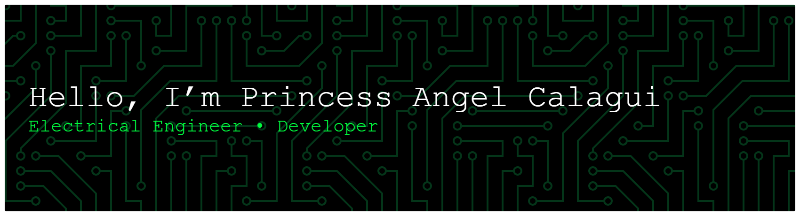

## Tech Stack

 

 

## About Me

**I'm an Electrical Engineer with a passion for technology, software development, and continuous learning.**.

**My background in electrical engineering has given me a strong foundation in problem-solving, technical design, and analytical thinking. Alongside engineering, I enjoy exploring the world of web development, programming, and digital technologies, where I can turn ideas into functional and creative projects.**

**I’m always looking for opportunities to learn new skills, improve my work, and take on challenging projects. Whether it’s developing a website, working on an engineering-related project, or exploring new technologies, I enjoy the process of learning and building something meaningful.**

**What I Do 
⚡ Electrical Engineering & Estimation 
💻 Web Development & Programming 
🎨 Creative & Digital Projects 
📚 Continuous Learning & Skill Development 
🚀 Exploring new technologies and ideas**

## GitHub Streaks Stats
 

## 📊 My Contribution Activity
  <!-- Pac-Man -->
<picture data-importer="pacman">
  <source media="(prefers-color-scheme: dark)" srcset="https://raw.githubusercontent.com/engr-angel/github-page/pacman-output/pacman-contribution-graph-dark.svg?game=pacman">
  <source media="(prefers-color-scheme: light)" srcset="https://raw.githubusercontent.com/engr-angel/github-page/pacman-output/pacman-contribution-graph.svg?game=pacman">
  
</picture>

##
  <!-- Sake -->

 

  <!-- Pac-Man -->

  

##

NO RESISTANCE CAN DROP YOUR POTENTIAL​

